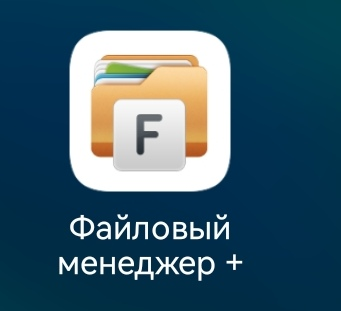
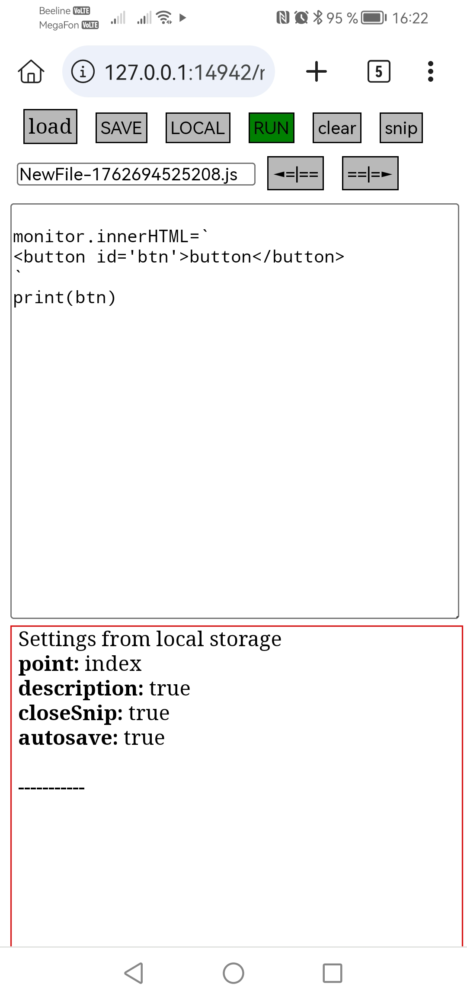

Очень простое решение, для небольштх эксперементов на JS прямо в телефоне
Проект содержит всего 3 файла index.html, style.css и script.js
Их нужно скоприровать в 1 папку и запустить в браузере index.html
В телефоне работает в приложении "файловый менеджер +" 

Открывшаяся страница будет выглядеть примерно так:

